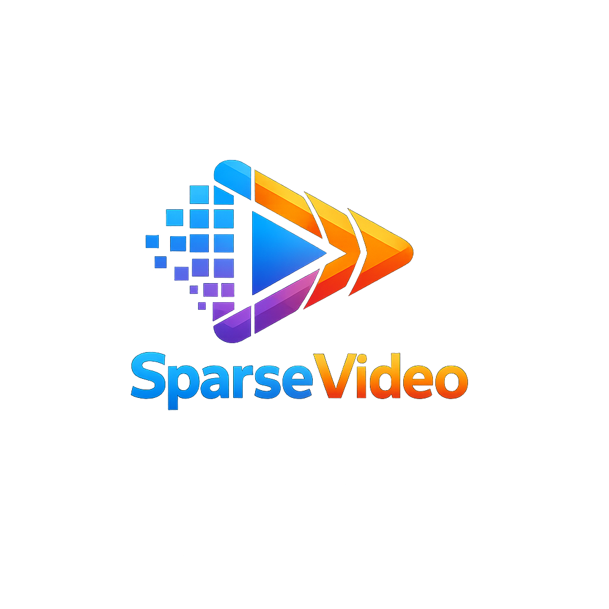

<p align="center">
  
</p>

# SparseVideo

#### A one-line, plug-and-play sparse attention framework for accelerating video diffusion inference.


## Installation

**From PyPI**

```bash
pip install sparsevideo --no-build-isolation
```

**From source**

```bash
git clone https://github.com/Mutual-Luo/SparseVideo.git
cd SparseVideo
MAX_JOBS=8 pip install -e . --no-build-isolation
```

## Quick Start

```diff
  import torch
  from diffusers import WanPipeline
  import sparsevideo

  pipe = WanPipeline.from_pretrained("Wan-AI/Wan2.1-T2V-14B-Diffusers", torch_dtype=torch.bfloat16)
  pipe.to("cuda")

+ pipe = sparsevideo.replace_attention(pipe, method="svoo")

  video = pipe("A cat playing piano", num_frames=81, num_inference_steps=50).frames[0]
```

## Supported Sparse Attention Methods

| | Method | | Method | | Method |
|:---:|---|:---:|---|:---:|---|
| ✅ | `Dense` (baseline) | ✅ | `SpargeAttn` [[paper]](https://arxiv.org/abs/2502.18137) | ✅ | `Adacluster` [[paper]](https://arxiv.org/abs/2604.18348) |
| ✅ | `SVG1` [[paper]](https://arxiv.org/abs/2502.01776) | ✅ | `Radial` [[paper]](https://arxiv.org/abs/2506.19852) | ✅ | `SVOO` [[paper]](https://arxiv.org/abs/2603.18636) |
| ✅ | `SVG2` [[paper]](https://arxiv.org/abs/2505.18875) | ✅ | `STA` [[paper]](https://arxiv.org/abs/2502.04507) | ✅ | `FlashOmni` [[paper]](https://arxiv.org/abs/2509.25401) |
| ✅ | `SVG-EAR` [[paper]](https://arxiv.org/abs/2603.08982) | ✅ | `DraftAttention` [[paper]](https://arxiv.org/abs/2505.14708) | | |

## Supported Frameworks

Works as a drop-in, one-line replacement for both **Diffusers** and **DiffSynth-Studio** pipelines. Just call `sparsevideo.replace_attention(pipe, method=...)`, no model modifications required.

### Diffusers

Supported models:

| | Model | | Model | | Model |
|:---:|---|:---:|---|:---:|---|
| <sub>✅</sub> | <sub>Wan 2.1 Text-to-Video 1.3B</sub> | <sub>✅</sub> | <sub>Wan 2.2 Text-to-Video A14B</sub> | <sub>✅</sub> | <sub>Video-as-Prompt Wan 2.1 14B</sub> |
| <sub>✅</sub> | <sub>Wan 2.1 Text-to-Video 14B</sub> | <sub>✅</sub> | <sub>Wan 2.2 Image-to-Video A14B</sub> | <sub>✅</sub> | <sub>HunyuanVideo Text-to-Video</sub> |
| <sub>✅</sub> | <sub>Wan 2.1 Image-to-Video 14B</sub> | <sub>✅</sub> | <sub>Wan 2.2 Speech-to-Video 14B</sub> | <sub>✅</sub> | <sub>HunyuanVideo Image-to-Video</sub> |
| <sub>✅</sub> | <sub>Wan 2.1 VACE 1.3B</sub> | <sub>✅</sub> | <sub>Wan 2.2 Animate 14B</sub> | <sub>✅</sub> | <sub>CogVideoX Text-to-Video</sub> |
| <sub>✅</sub> | <sub>Wan 2.1 VACE 14B</sub> | <sub>✅</sub> | <sub>Wan 2.2-Fun A14B Control</sub> | <sub>✅</sub> | <sub>CogVideoX Image-to-Video</sub> |
| <sub>✅</sub> | <sub>Wan 2.1-Fun 1.3B Control</sub> | <sub>✅</sub> | <sub>Wan 2.2-Fun A14B Control-Camera</sub> | <sub>✅</sub> | <sub>EasyAnimate V5 Text-to-Video 12B</sub> |
| <sub>✅</sub> | <sub>Wan 2.1-Fun 1.3B InP</sub> | <sub>✅</sub> | <sub>SkyReels-V2 Text-to-Video 14B</sub> | <sub>✅</sub> | <sub>LTX-Video Text-to-Video</sub> |
| <sub>✅</sub> | <sub>Wan 2.1-Fun V1.1 1.3B Control</sub> | <sub>✅</sub> | <sub>SkyReels-V2 Image-to-Video 14B</sub> | <sub>✅</sub> | <sub>LTX-Video Image-to-Video</sub> |
| <sub>✅</sub> | <sub>Wan 2.1-Fun V1.1 1.3B Control-Camera</sub> | <sub>✅</sub> | <sub>MoVA 720P</sub> | <sub>✅</sub> | <sub>LTX-2</sub> |
| <sub>✅</sub> | <sub>Wan 2.1-Fun V1.1 14B Control</sub> | <sub>✅</sub> | <sub>LongCat-Video</sub> | <sub>✅</sub> | <sub>Mochi-1</sub> |
| <sub>✅</sub> | <sub>Wan 2.1-Fun V1.1 14B Control-Camera</sub> | <sub>✅</sub> | <sub>Krea Realtime Video 14B</sub> | <sub>✅</sub> | <sub>Allegro</sub> |
| <sub>✅</sub> | <sub>Wan 2.1 Speed-Control 1.3B</sub> | | | | |

### DiffSynth-Studio

Supported models:

| | Model | | Model | | Model |
|:---:|---|:---:|---|:---:|---|
| <sub>✅</sub> | <sub>Wan 2.1 Text-to-Video 1.3B</sub> | <sub>✅</sub> | <sub>Wan 2.1-Fun V1.1 1.3B Control</sub> | <sub>✅</sub> | <sub>Wan 2.2 Animate 14B</sub> |
| <sub>✅</sub> | <sub>Wan 2.1 Text-to-Video 14B</sub> | <sub>✅</sub> | <sub>Wan 2.1-Fun V1.1 1.3B Control-Camera</sub> | <sub>✅</sub> | <sub>Wan 2.2 Dancer 14B</sub> |
| <sub>✅</sub> | <sub>Wan 2.1 Image-to-Video 14B 480P</sub> | <sub>✅</sub> | <sub>Wan 2.1-Fun V1.1 14B Control</sub> | <sub>✅</sub> | <sub>Wan 2.2-Fun A14B Control</sub> |
| <sub>✅</sub> | <sub>Wan 2.1 Image-to-Video 14B 720P</sub> | <sub>✅</sub> | <sub>Wan 2.1-Fun V1.1 14B Control-Camera</sub> | <sub>✅</sub> | <sub>Wan 2.2-Fun A14B Control-Camera</sub> |
| <sub>✅</sub> | <sub>Wan 2.1 First-Last-Frame-to-Video 14B 720P</sub> | <sub>✅</sub> | <sub>Wan 2.1 VACE 1.3B</sub> | <sub>✅</sub> | <sub>LongCat-Video</sub> |
| <sub>✅</sub> | <sub>Wan 2.1 Speed-Control 1.3B</sub> | <sub>✅</sub> | <sub>Wan 2.1 VACE 14B</sub> | <sub>✅</sub> | <sub>Video-as-Prompt Wan 2.1 14B</sub> |
| <sub>✅</sub> | <sub>Wan 2.1-Fun 1.3B Control</sub> | <sub>✅</sub> | <sub>Wan 2.2 Text-to-Video A14B</sub> | <sub>✅</sub> | <sub>Krea Realtime Video 14B</sub> |
| <sub>✅</sub> | <sub>Wan 2.1-Fun 1.3B InP</sub> | <sub>✅</sub> | <sub>Wan 2.2 Image-to-Video A14B</sub> | <sub>✅</sub> | <sub>MoVA 720P</sub> |
| <sub>✅</sub> | <sub>Wan 2.1-Fun 14B Control</sub> | <sub>✅</sub> | <sub>Wan 2.2 Text/Image-to-Video 5B</sub> | <sub>✅</sub> | <sub>LTX-2</sub> |
| <sub>✅</sub> | <sub>Wan 2.1-Fun 14B InP</sub> | <sub>✅</sub> | <sub>Wan 2.2 Speech-to-Video 14B</sub> | <sub>✅</sub> | <sub>LTX-2.3</sub> |

## License

Apache-2.0
